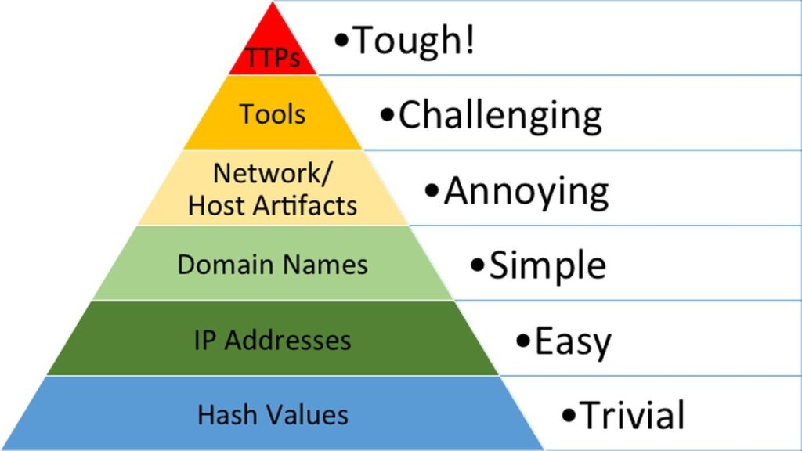
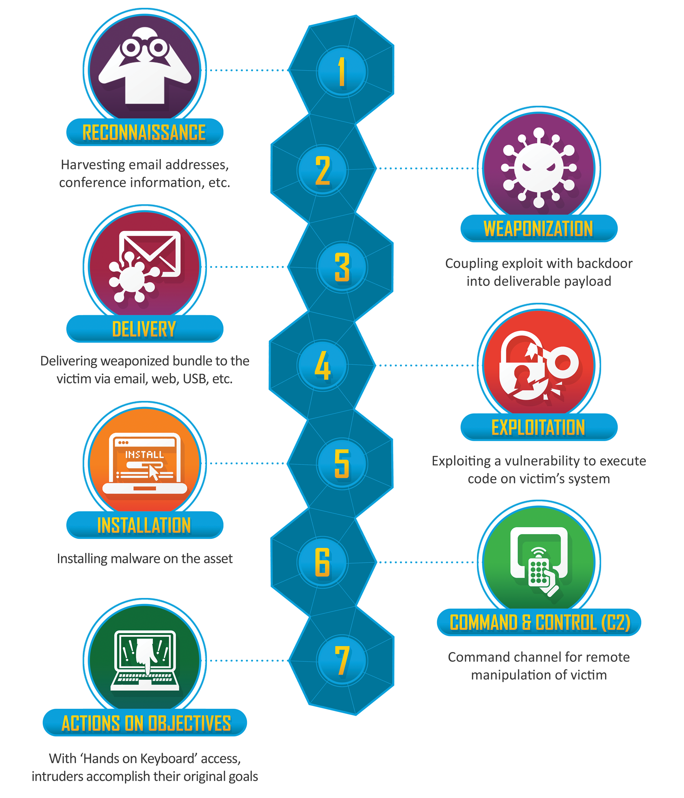
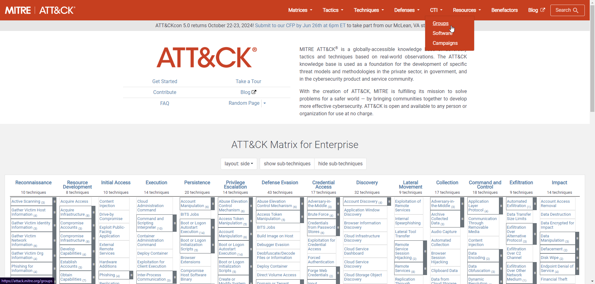
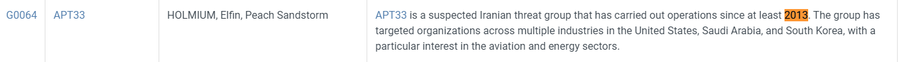
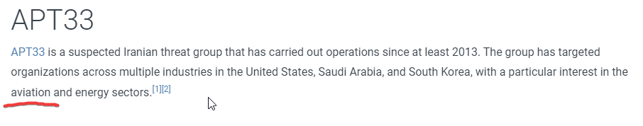
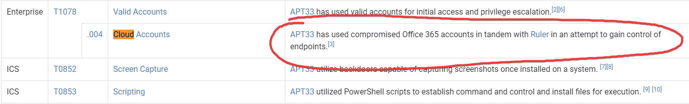
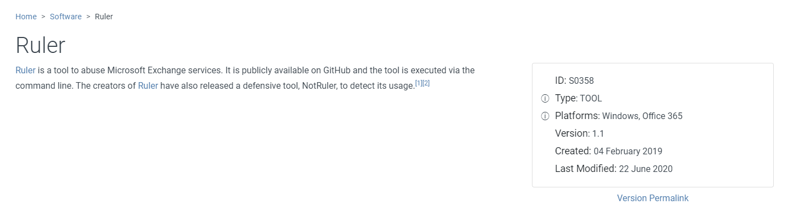
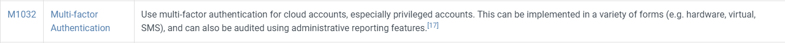
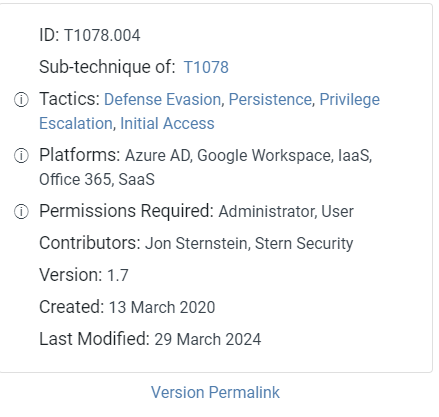

# Cyber Defence Frameworks

## Table of Contents

- [An Introduction to Defence Frameworks](#introduction)
- [Pyramid of Pain](#pyramid-of-pain)
- [Cyber Kill Chain](#cyber-kill-chain)
- [MITRE Frameworks](#mitre-frameworks)
- [ATT&CK Threat Intelligence Walkthrough](#attck-threat-intelligence-walkthrough)
- [Resources](#resources)

## Introduction

It is important for all members of an organisations security team to understand an adversaries techniques and attack stages.

Cyber Defence Frameworks do just that. They are a set of policies and guidelines that help an organisation establish a good security posture and protect their assets.

Having knowledge of these frameworks can help professionals investigating and responding during security incidents.

There are many cyber security frameworks designed for this purpose, and the [TryHackMe Cyber Defence Framework room](https://tryhackme.com/module/cyber-defence-frameworks) focuses in on a select few.

- Pyramid of Pain
- Cyber Kill Chain
- Unified Kill Chain
- Diamond Model
- MITRE Frameworks

Here is a brief overview of some.

## Pyramid of Pain

The Pyramid of Pain is a cyber security model created by David J. Bianco in 2013. It focusses on increasing the difficulty for an adversary to operate against a given organisation.

It is a model that illustrates the effectiveness of different types of `indicators of compromise (IoCs)` in detecting and mitigating cyber threats. The pyramid visually represents the relationship between the type of indicator and the amount of pain (effort and difficulty) it causes an adversary when you use that indicator to detect and respond to their activities.# Cyber Defence Frameworks

A trivial example is that of `Hash Values`. They are a fixed length numerical values that can uniquely identify data; unique digital fingerprints of files. Hashes are computed using hashing algorithms, with the most common algorithm being `Secure Hash Algorithm 256 bits (SHA-256)`.

Security professionals can use the hash of a specific strain of malware and effectively filter it from an organisation network configured through any number of security tools.

However, due to the nature of hashing, an adversary can alter just one bit in a malicious executable to produce a completely different value and evade any detections put in place. This is `trivial` for attackers to work around and therefore places this mitigation at the bottom of the pyramid.

## Cyber Kill Chain

The `Cyber Kill chain` is a security model developed by Lockheed Martin in 2011. It is an evolution of the military kill chain that identifies the structure of an attack.

The `Cyber Kill Chain` is a step-by-step approach to identify and stop enemy activity.

It does so by outlining the stages of common cyber attacks and the points within these stages that security teams can intercept attackers.

There are 7 phases of the kill chain:

1. Reconnaissance

   - The attacker gathers information about the target.

2. Weaponisation

   - The attacker creates a deliverable payload to exploit the vulnerabilities identified during reconnaissance.

3. Delivery

   - The attacker sends the weaponised payload to the target.

4. Exploitation

   - The malicious payload exploits a vulnerability on the target system, gaining initial access.

5. Installation

   - The attacker installs malware on the target system to maintain a foothold in the environment.

6. Command and Control (C2)

   - The attacker establishes a communication channel to remotely control the compromised system.

7. Actions on Objective
   - The attacker performs actions to achieve their goals, which can vary based on their objectives.

## MITRE Frameworks

`MITRE` is a not-for-profit that supports U.S. government agencies. They have developed several cyber security frameworks that are widely used in the industry including:

1. MITRE ATT&CK Framework
2. MITRE D3FEND Framework
3. MITRE Cyber Analytics Repository (CAR)
4. MITRE ENGAGE

and more...

The most widely known is the `MITRE ATT&CK (Adversarial Tactics, Techniques, and Common Knowledge) framework`.

It is a knowledge base of adversary tactics and techniques based on real-world observations and is used to understand and analyse the behaviour of cyber attackers.

- **Tactics**: The "why" of an attack technique. These are the adversary's tactical goals, the reasons for performing an action (e.g., initial access, execution, persistence).
- **Techniques**: The "how" of an attack. These are the methods adversaries use to achieve their tactical goals (e.g., spear-phishing, credential dumping).
- **Sub-Techniques**: More detailed methods under a broader technique (e.g., spear-phishing via service under phishing).
- **Use Cases**: Threat intelligence, defensive gap assessment, and red teaming exercises.

## ATT&CK Threat Intelligence Walkthrough

To close out the Cyber Defence Module on TryHackMe, there is a practical component that focuses on using the MITRE ATT&CK Framework for threat intelligence. Below is my walkthrough.

**Scenario**: You are a security analyst who works in the aviation sector. Your organisation is moving their infrastructure to the cloud. Your goal is to use the ATT&CK® Matrix to gather threat intelligence on APT groups who might target this particular sector and use techniques targeting your areas of concern. You are checking to see if there are any gaps in coverage. After selecting a group, look over the selected group's information and their tactics, techniques, etc.

1. What is a group that targets your sector who has been in operation since at least 2013?

CTI (Cyber Threat Intelligence) dropdown on the main page of the framework shows a list of known Groups/Adversaries.

Searching the page for the string '2013' produces a few results, one of which is APT33, that specifically targets aviation.

Answer: APT33

2. As your organisation is migrating to the cloud, is there anything attributed to this APT group that you should focus on? If so, what is it?

Searching the page for the string 'Cloud' produces the result of Cloud Accounts, which APT33 have been known to target.

Answer: Cloud Accounts

3. What tool is associated with the technique from the previous question?

From the above question, we can see that 'Ruler' is also used to attempt to gain control of endpoints.

Answer: Ruler

4. Referring to the technique from question 2, what mitigation method suggests using SMS messages as an alternative for its implementation?

By clicking on the [Cloud Accounts](https://attack.mitre.org/techniques/T1078/004/) hyperlink and searching the page for SMS, we can see that Multi-factor Authentication suggests to use SMS as an implementation.

Answer: Multi-factor Authentication

5. What platforms does the technique from question #2 affect?

On the right hand side of the [Cloud Accounts](https://attack.mitre.org/techniques/T1078/004/) page, the platforms are listed.

Answer: Azure AD, Google Workspace, IaaS, Office 365, SaaS

## Resources

- https://www.sans.org/tools/the-pyramid-of-pain/
- https://www.attackiq.com/glossary/pyramid-of-pain/
- https://www.lockheedmartin.com/en-us/capabilities/cyber/cyber-kill-chain.html
- https://www.crowdstrike.com/cybersecurity-101/cyber-kill-chain/
- https://www.mitre.org/who-we-are
- https://attack.mitre.org/
